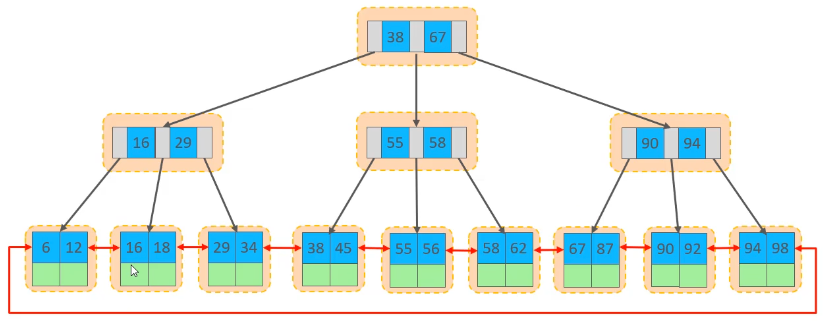
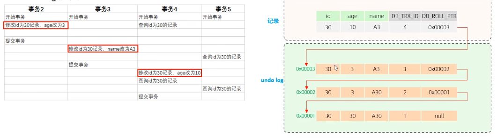

# 索引

## 索引概述

### 存储结构


## 索引结构

### BTree

### Hash

## 索引分类

| 分类     | 含义                                                 | 特点                     | 关键字   |
| -------- | ---------------------------------------------------- | ------------------------ | -------- |
| 主键索引 | 针对于主键创建的索引                                 | 默认自动创建，只能有一个 | PRIMARY  |
| 唯一索引 | 避免同一个表中某数据列中的值重复                     | 可以有多个               | UNIQUE   |
| 常规索引 | 快速定位特定数据                                     | 可以有多个               |          |
| 全文索引 | 全文索引查找的是文本中的关键词，而不是比较索引中的值 | 可以有多个               | FULLTEXT |

 在InnoDB存储引擎中，根据索引的存储形式，又可以分为以下两种

| 分类     | 含义                                                       | 特点                 |
| -------- | ---------------------------------------------------------- | -------------------- |
| 聚集索引 | 将数据与索引放到了一块，索引结构的叶子节点保存了行数据     | 必须有，而且只有一个 |
| 二级索引 | 将数据与索引分开存储，索引结构的叶子节点关联的是对应的主键 | 可以存在多个         |

聚集索引选取规则：

- 如果存在主键，主键索引就是聚集索引

- 如果不存在主键，将使用第一个唯一索引作为聚集索引

- 如果表没有主键，或没有合适的唯一索引，则InnoDB会自动生成一个rowid作为隐藏的聚集索引 

### 聚集索引


### 二级索引


 ### 回表查询

先根据二级索引找到对应的主键值，再根据主键值到聚集索引中查到这一行的数据

## 索引语法

- 创建索引

```sql
CREATE [UNIQUE|FULLTEXT] INDEX index_name ON table_name (index_col_name,...);
```

- 查看索引

```sql
SHOW INDEX FROM table_name;
```

- 删除索引

```sql
DROP INDEX index_name ON table_name;
```

## SQL性能分析

- SQL执行频率

```sql
SHOW GLOBAL STATUS LIKE 'Com_______';
```

- 慢查询日志 

```sql
# 慢查询日志有没有打开
SHOW VARIABLES LIKE 'slow_query_log';
```

配置文件在/etc/my.cnf 中

```sql
# 开启慢查询日志
slow_query_log=1
# 慢查询日志时间
long_query_time=2
# 开启慢查询
set global log_slow_queries=ON; 
```

- show profile

  ```sql
  # 查询是否支持
  mysql> SELECT @@have_profiling;
  +------------------+
  | @@have_profiling |
  +------------------+
  | YES              |
  +------------------+
  # 查询是否开启
  mysql> select @@profiling;
  +-------------+
  | @@profiling |
  +-------------+
  |           0 |
  +-------------+
  # 设置开启
  mysql> set profiling=1;
  Query OK, 0 rows affected, 1 warning (0.02 sec)
  # 查询耗时
  mysql> show profiles;
  +----------+------------+--------------------+
  | Query_ID | Duration   | Query              |
  +----------+------------+--------------------+
  |        1 | 0.02334625 | select @@profiling |
  +----------+------------+--------------------+
  # 查看耗时在什么地方
  mysql> show profile for query 1;
  +----------------------+----------+
  | Status               | Duration |
  +----------------------+----------+
  | starting             | 0.020424 |
  | checking permissions | 0.000440 |
  | Opening tables       | 0.000773 |
  | init                 | 0.000220 |
  | optimizing           | 0.000198 |
  | executing            | 0.000289 |
  | end                  | 0.000077 |
  | query end            | 0.000077 |
  | closing tables       | 0.000077 |
  | freeing items        | 0.000472 |
  | cleaning up          | 0.000300 |
  +----------------------+----------+
  ```

  - explain执行计划

  ```sql
  mysql> EXPLAIN select * from tb_user;
  +----+-------------+---------+------------+------+---------------+------+---------+------+------+----------+-------+
  | id | select_type | table   | partitions | type | possible_keys | key  | key_len | ref  | rows | filtered | Extra |
  +----+-------------+---------+------------+------+---------------+------+---------+------+------+----------+-------+
  |  1 | SIMPLE      | tb_user | NULL       | ALL  | NULL          | NULL | NULL    | NULL |    2 |   100.00 | NULL  |
  +----+-------------+---------+------------+------+---------------+------+---------+------+------+----------+-------+
  1 row in set, 1 warning (0.03 sec)
  ```

  

| 字段          | 含义                                                         |
| ------------- | ------------------------------------------------------------ |
| id            | 序号，id越大，越先执行，id相同，按照顺序从上到下             |
| select_type   | SELECT类型，常见的有SIMPLE(简单表，不使用表连接或者子查询),PRIMARY(主查询，即外层的查询),UNION(UNION中的第二个或者后面的查询语句),SUBQUERY(SELECT/WHERE之后的包含子查询) |
| table         | 显示这一行数据是关于哪张表的                                 |
| partitions    | 查询将从哪些分区中获取数据                                   |
| type          | 表示连接类型，性能从高到低为：NULL->system->const->eq_ref->ref->range->index->all |
| possible_keys | 可能用到的索引                                               |
| key           | 实际使用到的索引                                             |
| key_len       | 使用到的索引的字节数，它为最大可能长度，非实际使用长度，在不损失精确性的情况下，越短越好 |
| ref           | 索引引用，  显示索引的哪一列被使用了，如果可能的话，是一个常数const |
| rows          | 必须要查询的行数，在Innodb中是一个估计值，可能并不是准确的   |
| filtered      | 返回结果的行数占读取行数的百分比，越大越好                   |
| Extra         | 额外信息                                                     |

## 最左前缀法则

如果索引了多列，要遵守最左前缀法则，最左前缀法则指的是查询从索引的最左列开始，并且不跳过索引的列，如果跳过某一列，索引将部分失效（后面的字段索引失效）

在联合索引中，出现范围查询()>,<)，范围右侧的列索引失效

## 索引失效情况

- 索引列运算

不要在索引列上进行运算，索引将失效

- 字符串不加引号

字符串字段使用时，如果不加引号，索引将失效

- 模糊查询

如果仅仅是尾部模糊查询，索引不回失效，如果头部模糊匹配，索引失效

- or连接的条件

用or分隔开的条件，如果or前的条件中有索引，而后面的列没有索引，那么设计到的索引不会被用到

- 数据分布影响

如果MySQL评估使用索引比全表更慢，则不会用索引

## SQL提示

```sql
# 使用索引
USE INDEX()
# 忽略索引
IGNORE INDEX()
# 强制使用
FORCE INDEX()
```

## 覆盖索引

尽量使用覆盖索引，查询使用了索引，并且需要返回的列，在该索引中已经全部都能够找到，减少select

## 前缀索引

 当字段类型为字符串时，有时候需要索引很长的字符串，这会让索引变的很大，查询时，浪费磁盘IO，影响查询效率。此时可以直将字符串的一部分前缀建立索引，这样可以大大节约索引空间，从而提高索引效率 

```sql
CREATE INDEX idx_xxx on table_name(column(n));
```

### 前缀长度

可以根据索引的选择性来选择，而选择性是指不重复的索引值(基数)和数据表的记录总数的比值，索引选择性越高则查询效率越高，唯一索引的选择性是1，这是最好的索引选择性，性能也是最好的

```sql
SELECT COUNT(distinct email) / COUNT(*) from tb_user;
SELECT COUNT(distinct ssubstring(email, 1, 5)) / COUNT(*) from tb_user;
```

## 单列索引和联合索引的选择 

在业务场景中，如果存在多个查询条件，考虑针对于查询字段建立索引时，建议建立联合索引，而非单列索引。

## 索引设计原则

- 针对于数据量较大，且查询比较频繁的表建立索引
- 针对于长作为查询条件(where)、排序(order by)、分组(group by)、操作的字段建立索引
- 尽量选择区分度高的列作为索引，尽量建立唯一索引，区分度越高，使用索引的效率越高
- 如果字段时字符串类型，字段的长度较长，可以针对字段的特点，建立前缀索引
- 尽量使用联合索引，减少单列索引，查询时，联合索引好多时候可以覆盖索引，节省存储空间，避免回表，提高查询效率
- 要控制索引的数量，索引并不是多多易善，索引越多，维护索引结构的代价就越大，回影响增删改的效率
- 如果索引列不能存储NULL值，请在创建表时使用NOT NULL约束它，当优化器知道每列是否包含NULL值时，可以更好的确定索引最终有效的用于查询

#  SQL优化

## 插入数据

- 批量插入
- 手动提交事务
- 主键顺序插入
- 大批量数据插入

如果一次性插入大批量数据，使用insert插入性能较低，此时可以使用load指令进行插入

```sql
# 连接时添加参数 --local-infile
mysql --local-infile -u root -p
# 设置全局参数local_infile，开启导入开关
mysql> set global local_infile=1;
Query OK, 0 rows affected (0.02 sec)
mysql> select @@local_infile;
+----------------+
| @@local_infile |
+----------------+
|              1 |
+----------------+
1 row in set (0.00 sec)
# 执行load指令将准备好的数据，加载到表中
mysql> load data local infile '/Users/tu/mysql/sql.log' into table `tb_user` fields terminated by ',' lines terminated by '\n';
Query OK, 8 rows affected (0.04 sec)
Records: 8  Deleted: 0  Skipped: 0  Warnings: 0

```

```txt
4,张4,123,男,北京
5,李5,456,男,北京
6,王6,789,男,北京
7,王7,789,男,北京
8,王8,789,男,北京
9,王9,789,男,北京
10,王20,789,男,北京
11,王11,789,男,北京
```

## 主键优化

- 数据组织形式

在Innodb中，表数据都是根据主键顺序组织存放的，这种存储方式的表称为索引组织表



- 页分裂

也可以为空，也可以填充一半，也可以填充100%，每个页包含了2-N行数据(如果一行数据过大，回行溢出)，根据主键排列

顺序插入


乱序插入会导致页分裂


- 页分裂

当删除一行数据，实际上并没有被物理删除，只是记录为删除，它的空间变得允许被其他记录声明使用，当页中删除的记录达到MERGE_THERSHOLD(默认页大小的50%)，Innodb会开始寻找最靠近的页(前或后)，看看是否可以将两个页合并以优化空间使用


### 主键设计原则

- 满足业务索引的情况下，尽量降低主键的长度
- 插入数据时，尽量选择顺序插入，选择AUTO_INCREMENT自增主键
- 尽量不要使用UUID做主键或者其他自然主键，如身份证号
- 业务操作时，避免对主键的修改

## order by 优化

### FileSort

通过表的索引或全表扫描，读取满足条件的数据行，然后在排序缓冲区sort buffer中完成的排序操作，所有不是通过索引直接返回排序结果的排序都叫FileSort排序

### index

通过有序索引顺序扫描直接返回有序数组，这种情况即为index，不需要额外排序，操作效率高

### 原则

- 根据排序字段建立合适的索引，多字段排序时，也遵循最左前缀法则
- 尽量使用覆盖索引
- 多字段排序时，一个升序一个降序，此时需要注意联合索引在创建时的规则(ASC/DESC)
- 如果不可避免出现FileSort，大数据量进行排序时，可以适当增大排序缓冲区大小sort_buffer_size(默认256k)

## group by 优化

- 在分组操作时，可以通过索引开提高效率
- 分组操作时，索引的使用也满足最左前缀法则

## limit 优化

limit 200000000,10，MySQL需要排序前200000010条记录，仅返回200000000-200000010的记录，查询排序的代价非常大

 分页查询时，通过创建 覆盖索引能够比较好的提高性能，可以通过覆盖索引加子查询的形式进行优化

## count 优化

MyISAM引擎吧一个表的总数存到了磁盘上，因此执行count(*)的时候会直接返回这个数，效率非常高

Innodb引擎执行count(*)的时候需要一行一行的从引擎里读取出来，然后累积计数

优化思路：建立一个其他表，自己计数

### 用法

count(字段)<count(主键id)<count(数字)<count(*)

- count(*)

Innodb引擎并不会把全部字段取出来，而是专门做了优化，直接按行进行累加

- count(主键) 

Innodb会遍历整张表，把每一行的主键id值取出来。返回服务层，直接按行进行累加

- count(字段)非空字段数量

没有NOT NULL，Innodb引擎会把每一行的字段值都取出来，返回服务层，服务层判断是否为NULL，然后累加

有NOT NULL，Innodb引擎会把每一行的字段值都取出来，返回服务层，直接累加

- count(数字)

Innodb引擎会遍历整张表，单不取值，服务层对于返回的每一行，都会放一个数字进去，直接按行进行累加

## update 优化

Innodb的行锁是针对索引加的锁，不是针对记录加的锁，并且该索引不能失效，否则会从行锁升级为表锁

#  视图

## 介绍

 视图是一种虚拟存在的表，视图中的数据并不会在数据库中真实存在，行和列的数据来自定义视图的查询中使用的表，并且是在使用视图时动态生成的。视图值保存了查询的SQL逻辑，不保存查询结果，所以我们在创建视图时，主要工作在创建这条查询的SQL语句上

## 语法

### 创建

```sql
CREATE [OR REPLACE] 
[ALGORITHM = {UNDEFINED | MERGE | TEMPTABLE}]
[  = user]
[SQL SECURITY { DEFINER | INVOKER }]
VIEW view_name [(column_list)]
AS select_statement
[WITH [CASCADED | LOCAL] CHECK OPTION];
```

1. OR REPLACE：如果视图已存在则替换原有视图

2. ALGORITHM

- UNDEFINED: MySQL自动选择算法
- MERGE: 将视图的查询语句与外部查询合并
- TEMPTABLE: 将视图结果存入临时表

3. DEFINER:指定视图的创建者

4. SQL SECURITY：指定视图的安全性

- DEFINER: 以创建者权限检查
- INVOKER: 以调用者权限检查

5. WITH CHECK OPTION:在更新视图时保证更新结果满足视图定义的条件

- LOCAL CHECK OPTION`：只检查当前视图的条件
- CASCADED CHECK OPTION：检查当前视图及其依赖的所有视图的条件（默认选项）

### 查看视图

```sql
# 查看所有视图
mysql> SHOW FULL TABLES WHERE table_type = 'VIEW';
+------------------+------------+
| Tables_in_caihao | Table_type |
+------------------+------------+
| stu_v_1          | VIEW       |
+------------------+------------+
1 row in set (0.04 sec)
# 查询 
mysql> select * from stu_v_1;
+----+----------+
| id | username |
+----+----------+
|  1 | 张三     |
|  2 | 李四     |
|  3 | 王五     |
+----+----------+
11 rows in set (0.02 sec)
```

### 修改视图

```sql
ALTER 
[ALGORITHM = {UNDEFINED | MERGE | TEMPTABLE}]
[DEFINER = user]
[SQL SECURITY { DEFINER | INVOKER }]
VIEW view_name [(column_list)]
AS select_statement
[WITH [CASCADED | LOCAL] CHECK OPTION];
```

#### 删除视图

```mysql
DROP VIEW IF EXISTS VIEW_NAME;
```

#### 视图更新

要使视图可更新，视图中的行，与基础表中的行必须存在一对一的关系，如果视图包含一下视图中的任何一项，则视图不可更新

- 聚合函数或窗口函数
- DISTINCT
- GROUP BY
- HAVING
- UNION或UNION ALL

#### 视图作用

- 操作简单，简化用户对数据的理解，也可以简化操作，经常被使用的查询可以被定义为视图，使得用户不必为以后的操作每次指定全部的条件
- 安全，数据库可以授权，但不能授权到数据库特定的行和特定的列上，通过视图用户只能查询和修改他们能见到的数据

# 存储情况

 存储过程是事先经过编译彬彬存储在MySQL数据库中的一段SQL语句的集合，调用存储过程可以简化应用开发人员的很多工作，减少数据在数据库和应用服务器之间的传输，对于提高数据处理的效率是有好处的，存储过程思想上很简单，就是数据库SQL语言层面的代码封装与重用

特点

- 封装，复用
- 可以接收参数，也可以返回数据
- 减少网络交互，效率提升

创建

```mysql
DELIMITER //  -- 临时修改分隔符（避免与过程中的分号冲突）

CREATE PROCEDURE procedure_name(
    [IN | OUT | INOUT] parameter1 datatype,
    [IN | OUT | INOUT] parameter2 datatype,
    ...
)
BEGIN
    -- 存储过程的逻辑代码
    -- 可以包含 SQL 语句、变量、条件判断、循环等
END //

DELIMITER ;  -- 恢复默认分隔符
```

参数

| 类型  | 含义                               | 备注 |
| ----- | ---------------------------------- | ---- |
| IN    | 输入，调用时传入值                 | 默认 |
| OUT   | 输出，作为返回值                   |      |
| INOUT | 可以作为输入参数，也可作为输出参数 |      |

调用

```mysql
CALL procedure_name([参数1, 参数2, ...]);
```

查看

```mysql
# 查看所有存储过程列表
SHOW PROCEDURE STATUS [LIKE 'pattern' | WHERE condition];
# 查看存储过程定义
SHOW CREATE PROCEDURE procedure_name;
# 通过系统表查询
SELECT * FROM information_schema.ROUTINES WHERE ROUTINE_TYPE = 'PROCEDURE' AND ROUTINE_SCHEMA = 'your_database_name';
```

删除

```mysql
DROP PROCEDURE [IF EXISTS] procedure_name; 
```

变量

- 系统变量：MySQL服务器提供，不是用户定义的，属于服务器层面，分为全局变量(GLOBAL)，会话变量(SESSION)。

查看系统变量

```mysql
# 查看所有系统变量
SHOW [SESSION | GLOBAL] VARIABLES;
# 通过LIKE模糊匹配
SHOW [SESSION | GLOBAL] VARIABLES LIKE 'xxx';
# 查看指定变量的值
SELECT @@[SESSION | GLOBAL] 系统变量名;
SELECT @@global.auto_generate_certs;

```

设置系统变量的值

```mysql
SET [GLOBAL | SESSION] 系统变量名=值;
SET @@[GLOBAL | SESSION] 系统变量名=值;
```

- 用户自定义变量：用户根据需求自己定义的变量，不用提前声明，使用时用@变量名，作用域为当前连接

设置用户自定义变量

```mysql
SET @var_name = expr [, @var_name=expr] ...;
SET @var_name := expr [, @var_name=expr] ...;

SELECT @var_name := expr [, @var_name=expr] ...;
SELECT 字段名 INTO @var_name FROM 表名;
```

使用

```mysql
SELECT @var_name;
```

- 局部变量：局部生效的变量，访问之前，需要DECLARE声明，可用作存储过程的局部变量和输入参数，局部变量的范围是在BEGIN和END之间

声明

```mysql
DECLARE 变量名 变量类型 [DEFAULT ... ];
```

变量类型就是数据库字段类型，INT，BIGINT，CHAR，VARCHAR，DATE，TIME等

赋值

```mysql
SET 变量名 = 值;
SET 变量名 := 值;
SELECT 字段名 INTO 变量名 FROM 表名;
```

IF条件语法

```mysql
IF 条件1 THEN
	...
ELSEIF 条件2 THEN
	...
ELSE
	...
END IF;
```

示例

```mysql
create procedure p2(
    in score int,
    out result varchar(10),
    inout count int
)
begin
    if score > 85 then
        set result = '优秀';
        set count = count + 1;
    elseif score >= 60 then
        set result = '及格';
    else
        set result = '不及格';
    end if;
end;

set @count = 0;
call p2(18, @result, @count);
call p2(98, @result, @count);
call p2(68, @result, @count);
select @result;
select @count;
```

CASE

语法1 

```mysql
CASE case_value
	WHEN when_value1 THEN statement_list1
	[WHEN when_value2 THEN statement_list2] ...
	[ELSE statement_list]
END CASE;
```

语法2

```mysql
CASE
	WHEN search_condition1 THEN statement_list1
	[WHEN search_condition2 THEN statement_list2] ...
	[ELSE statement_list]
END CASE;
```

示例

```mysql
create procedure getQuarterByMonth(
    in month int,
    out quarter int
)
begin
    CASE
        when month > 1 and month <= 3 then set quarter = 1;
        when month > 4 and month <= 6 then set quarter = 2;
        when month > 7 and month <= 9 then set quarter = 3;
        when month > 10 and month <= 12 then set quarter = 4;
        else set quarter = -1;
    END CASE;
end;

call getQuarterByMonth(14, @result);
select @result;
```

while

while是有条件的循环控制语句，满足条件后，再执行循环体中的SQL语句

```mysql
WHILE 条件 DO
	SQL 逻辑...
END WHILE;
```

示例

```mysql
create procedure mySum(
    in num int,
    out sum int
)
begin
    set sum = 0;
    while num > 0 do
        set sum = sum + num;
        set num = num - 1;
    end while;
end;

call mySum(10, @sum);
select @sum;
```

repeat

repeat是有条件的循环控制语句，满足条件后退出循环

```mysql
REPEAT
	SQL 逻辑...
	UNTIL 条件
END REPEAT;
```

示例

```mysql
create procedure mySum(
    in num int,
    out sum int
)
begin
    set sum = 0;
    repeat
        set sum = sum + num;
        set num = num - 1;
    until num <= 0  end repeat;
end;

call mySum(10, @sum);
select @sum;
```

LOOP

LOOP实现简单的循环，如果不在SQL逻辑中增加退出循环的条件，可以用来实现简单的死循环，LOOP可以配合一下两个语句使用

- LEAVE：配合循环使用，退出循环
- ITERATE：必须在循环中，作用是跳过当前循环剩下的语句，直接进入下一次循环

```mysql
[begin_label:] LOOP
	SQL逻辑
END LOOP [end_label];
LEAVE lable
ITERATE label

```

示例

```mysql
create procedure mySum(
    in num int,
    out total int 
)

begin
    set total = 0;
    sum:loop
        if num < 0 then
            leave sum;
        end if;
        if num % 2 = 1 then
            set num = num -1;
            iterate sum;
        end if;
        set total = total + num;
        set num = num - 1;
    end loop sum;
end;

call mySum(10, @total);
select @total;
```

游标

存储查询结果集的数据类型，在存储过程和函数中可以使用游标对结果集进行循环的处理

声明游标

```mysql
DECLARE 游标名称 CURSOR FOR 查询语句
```

打开游标

```mysql
OPEN 游标名称
```

获取游标记录

```mysql
FETCH 游标名称 INTO 变量1,...;
```

条件处理程序

```mysql
DECLARE handler_action HANDLER FOR condition_value ... statement;

handler_action 
	CONTINUE: 继续执行当前程序
	EXIT: 终止执行当前程序
condition_value
	SQLSTATE sqlate_value: 状态码，如02000
	SQLWARNING: 所有以01开头的SQLSTATE代码的简写
	NOT FOUND: 所有以02开头的SQLSTATE代码的简写
	SQLEXCEPTION: 所有没有被SQLWARNING或NOT FOUND捕获的SQLSTATE代码的简写
```

代码示例：

```mysql
create procedure myEmployees(
    in u_salary decimal
)
begin
    declare uname varchar(20);
    declare uId int;
    declare e_cursor cursor for select emp_id, name from employees where salary > u_salary;
    declare exit handler for not found close e_cursor;
    drop table if exists employees_pro;
    create table if not exists employees_pro
    (
        emp_id int primary key auto_increment,
        name   varchar(20)
    );

    open e_cursor;
    while true
        do
            fetch e_cursor into uId, uname;
            insert into employees_pro values (uId, uname);
        end while;
    close e_cursor;
end;

call myEmployees(5000);
```

存储函数

具有返回值的存储过程，存储函数的参数只能是IN类型，具体语法如下：

```mysql
CREATE FUNCTION 存储函数名称([参数列表])
RETURN type [characteristic ... ]
BEGIN
	-- SQL语句
	RETURN ... ;
END;
```

characteristic说明:

- DETERMINISTIC：相同的输入参数总是残生相同的结果
- NO SQL：不包含SQL语句
- READS SQL DATA：包含读书数据的语句，但不包含写入数据的语句

示例代码

```mysql
CREATE FUNCTION mySum (
    num INT
) RETURNS int DETERMINISTIC
BEGIN
   DECLARE total INT DEFAULT 0;
   WHILE num > 0 DO
       SET total = total + num;
       SET num = num - 1;
   END WHILE;
   RETURN total;
END;

set @total = mySum(3);
select @total;
```

# 触发器

触发器是与表有关的数据库对象，指在insert/update/delete之前或之后，触发并执行触发器中定义的SQL语句，触发器可以协助应用在数据库端确保数据的完整性，日志记录，数据校验等操作。

使用别名OLD和NEW来应用触发器中发生变化的记录内容，现在MySQL只支持行级触发，不支持语句级触发

| 触发器类型 | OLD            | NEW            |
| ---------- | -------------- | -------------- |
| INSERT     |                | 新增的数据     |
| UPDATE     | 修改之前的数据 | 已经修改的数据 |
| DELETE     | 将要删除的数据 |                |

创建

```mysql
CREATE TRIGGER 触发器名称
触发时机 触发事件 ON 表名
FOR EACH ROW  -- 每行触发（MySQL仅支持行级触发器）
BEGIN
    -- 触发器逻辑（可使用 NEW 和 OLD 访问数据）
END;

触发时机：
	BEFORE
	AFTER
触发事件
	INSERT
	DELETE
	UPDATE
```

查看

```mysql
SHOW TRIGGERS;                     -- 列出所有触发器
SHOW CREATE TRIGGER 触发器名称;      -- 查看具体定义
```

删除

```mysql
DROP TRIGGER [IF EXISTS] 触发器名称;
```

示例

```mysql
CREATE TABLE users
(
    id         INT PRIMARY KEY AUTO_INCREMENT,
    username   VARCHAR(50),
    created_at DATETIME
);

CREATE TABLE user_audit
(
    id          INT PRIMARY KEY AUTO_INCREMENT,
    user_id     INT,
    action      VARCHAR(10),
    change_time DATETIME
);

CREATE TRIGGER log_user_insert
    AFTER INSERT
    ON users
    FOR EACH ROW
BEGIN
    INSERT INTO user_audit (user_id, action, change_time)
    VALUES (NEW.id, 'INSERT', NOW());
END;

CREATE TRIGGER log_user_update
    AFTER UPDATE
    ON users
    FOR EACH ROW
BEGIN
    INSERT INTO user_audit (user_id, action, change_time)
    VALUES (NEW.id, 'UPDATE', NOW());
END;

CREATE TRIGGER log_user_delete
    AFTER DELETE
    ON users
    FOR EACH ROW
BEGIN
    INSERT INTO user_audit (user_id, action, change_time)
    VALUES (OLD.id, 'DELETE', NOW());
END;

SHOW TRIGGERS;

INSERT INTO users (username, created_at) VALUES ('Alice', NOW());
INSERT INTO users (username, created_at) VALUES ('Marry', NOW());
INSERT INTO users (username, created_at) VALUES ('Jack', NOW());

UPDATE users set username='hello' WHERE id = 3;

DELETE FROM users WHERE id = 3;

SHOW TRIGGERS;

DROP TRIGGER IF EXISTS log_user_insert;
DROP TRIGGER IF EXISTS log_user_update;
DROP TRIGGER IF EXISTS log_user_delete;
```

# 锁

## 概述

锁是计算机卸掉多个进程或线程并发访问某一资源的机制，在数据库中，除传统计算资源(CPU、RAM、I/O)的争用以外，数据也是一种供许多用户共享的资源，如何保证数据并发访问的一致性，有效性是数据库必须解决的一个问题，锁冲突也是影响数据库兵法访问性能的一个重要因素，从这个角度来说，锁对数据库而言是尤为重要的，也更加复杂

- 全局锁：锁定数据库中的所有锁
- 表级锁：每次操作锁住整张表
- 行级锁：每次操作锁住对应的行数据

## 全局锁 

对整个数据实例进行加锁，加锁后整个实例就处于只读状态，后续的DML语句，DDL语句，已经更新操作的事务提交语句都将被阻塞，典型的使用场景是做全库的逻辑备份，对所有表进行锁定，从而获取一致性视图，保证数据的完整性。

```mysql
# 加锁 
flush tables with read lock;
# 备份
mysqldump -uroot -p123 itcast > itcast.sql
# 解锁
unlock tables;
```

特点

- 如果在主库上备份，在备份期间都不能执行更新，业务基本上就得停摆
- 如果在从库上备份，在备份期间从库不能执行主库同步过来的二进制日志，会导致主从延迟

在InnoDB中，可以在备份中加上参数 --single-transaction 参数来完成不加锁的一致性数据库备份

--single-transaction 的本质是：通过事务的隔离性和MVCC机制，在备份开始时冻结逻辑视图，后续读取均基于该视图的历史版本数据，从而避免锁竞争。这是InnoDB在支持高并发场景下实现一致性备份的核心设计。

## 表级锁 

每次操作锁住整张表，锁定粒度大，发生锁冲突粒度最高，并发度最低，应用在MyISAM、InnoDB、BDB等存储引擎中，它主要分为以下三类

1. 表锁：分为表共享读锁和表独占写锁 

语法

```mysql
# 加锁
lock tables 表名 ... read/write;
unlock tables / 客户端断开连接
```

2. 元数据锁(meta data lock，MDL)

MDL加锁过程是系统自动控制的，无需显示使用，在访问一张表的时候会自动加上，MDL锁住要作用是维护表元数据的数据一致性，在表上有活动事务的时候，不可以对元数据进行写入操作，为了避免DML和DDL冲突，保证读写的正确性

在MySQL5.5中引入了MDL，对一张表进行增删改查的时候，会加MDL读锁(共享)，当对表结构进行变更操作的时候，加MDL写锁(排他)

| SQL                                           | 锁类型                             | 说明                                             |
| --------------------------------------------- | ---------------------------------- | ------------------------------------------------ |
| lock tables xxx read/write                    | SHARED_READ_ONLY/SHARED_READ_WRITE |                                                  |
| select、select ... lock in share mode         | SHARED_READ                        | 与SHARED_READ、SHARED_WRITE兼容，与EXCLUSIVE互斥 |
| insert、update、delete、select ... for update | SHARED_WRITE                       | 与SHARED_READ、SHARED_WRITE兼容，与EXCLUSIVE互斥 |
| alter table                                   | EXCLUSIVE                          | 与其他的MDL都互斥                                |

```mysql
# 查看
select * from performance_schema.metadata_locks;
```

3. 意向锁

为了避免DML在执行时，加的行锁和表锁的冲突，在InnoDB中引入了意向锁，使得表锁不用检查每行数据是否加锁，使用意向锁来减少表锁的检查

- 意向共享锁：与表锁共享锁(read)兼容，与表锁排它锁(write)互斥
- 意向排他锁：与表锁共享锁(read)及表锁排它锁(write)都互斥，意向锁之间不会互斥

## 行级锁

行锁每次操作锁住一行数据。开销大，加锁慢；会出现死锁；锁定粒度最小，发生锁冲突的概率最低，并发度最高。应用在InnoDB存储引擎中

InnoDB的数据是基于索引组织的，行锁是通过索引上的索引项加锁实现的，而不是对记录加的锁，行级锁主要分为以下三类

1. 行锁：锁定但行记录的锁，防止其他事务对此进行update和delete，在RC，RR隔离级别下都支持

- 共享锁：允许一个事务去读一行，防止其他事务获得相同数据级的排他锁
- 排他锁：允许获取排他锁的事务更新数据，阻止其他事务获得相同数据集的共享锁和排他锁

|           | S(共享锁) | X(排他锁) |
| --------- | --------- | --------- |
| S(共享锁) | 兼容      | 冲突      |
| X(排他锁) | 冲突      | 冲突      |


| SQL                          | 行锁类型 | 说明                                  |
| ---------------------------- | -------- | ------------------------------------- |
| INSERT                       | 排他锁   | 自动加锁                              |
| UPDATE                       | 排他锁   | 自动加锁                              |
| DELETE                       | 排他锁   | 自动加锁                              |
| SELECT                       | 不加锁   |                                       |
| SELECT ... LOCK INSHARE MODE | 共享锁   | 需要手动在SELECT后加LOCK INSHARE MODE |
| SELECT ... FOR UPDATE        | 排他锁   | 需要手动在SELECT后加FOR UPDATE        |

默认情况下，InnoDB在PR事务隔离级别运行，InnoDB会使用next-key锁进行搜索和索引扫描，一防止幻读

针对唯一索引进行检索时，对已存在的记录进行等值匹配时，将自动优化为行锁

InnoDB的行锁是对于索引加的锁，不通过索引条件检索数据，那么InnoDB将对表中的所有记录加锁，此时就会升级为表锁

2. 间隙锁：锁定索引记录间隙(不含该记录)，确保索引纪律间隙不变，防止其他事务在这个间隙进行insert，产生幻读，在RR隔离级别下都支持

默认情况下，InnoDB在PR事务隔离级别运行，InnoDB使用next-key锁进行搜素和索引扫描，以防止幻读

- 索引上的等值查询(唯一索引)，给不存在的记录加锁时，优化为间隙锁
- 索引上的等值查询(普通一索引)，向右遍历时最后一个值不满足查询需求时，next-key lock退化为间隙锁
- 索引上的范围查询(唯一索引)，会访问到不满足条件的第一个值为止

间隙锁唯一目的是防止其他事务插入间隙，间隙锁可以共存，一个事务采用的间隙锁不回阻止另一个事务在同一个间隙上采用间隙锁

3. 临键锁：行锁和间隙锁组合，同时锁住数据，并锁住前面的间隙Gap，在RR隔离级别下都支持

# Innodb 引擎


Log Buffer


磁盘结构


表空间


 


## 事务


持久性


undo log


## MVCC 

### 当前读

读取的是当前的记录的最新版本，读取时还要保证其他并发事务不能修改当前记录，会对读取的记录进行加锁，对于我们日常的操作，如select ... lock in share mode(共享锁)，select for update，update，insert，delete(排他锁)都是一种当前读

### 快照读

简单的select就是快照读，读取的是记录的可见版本，有可能是历史版本，是非阻塞读

- Read Committed：每次select，都回生成一个快照读
- Repeatable Read：开启事务后第一个select语句才是快照读的地方
- Serializable：快照读回退化为当前读

MVCC，多版本并发控制，指维护一个数据的讴歌版本，使得读写操作没有冲突，快照读为MySQL实现MVCC提供了一个非阻塞读功能，MVCC的具体实现，还要依赖于数据库记录中的三个隐式字段，undo log日志，readView

| 字段       | 含义                                                         |
| ---------- | ------------------------------------------------------------ |
| DB_TRX_ID  | 最近修改的事务ID，记录插入这条记录或最后一次修改改记录的事务ID |
| DB_ROLL_ID | 回滚指针，只想这条记录的上一个版本，用于配合undo log，指向上一个版本 |
| DB_ROW_ID  | 隐藏主键，如果表结构没有指定主键，将会生成该隐藏字段，否则不回出现 |

undo log

回滚日志，在insert，update，delete的时候产生的便于数据回滚的日志

当insert的时候，产生的undo log日志只在回滚时需要，在事务提交后，可悲立即删除

当update，delete的时候，产生的undo log日志不仅在回滚时需要，在快照读时也需要，不回立即被删除

undo版本链



不同事务或相同事务对同一条记录进行修改，回导致该记录的undo log生成一条版本记录链条，链表的头部是最新的旧记录，链表尾部是最早的旧记录

### ReadView

快照读是SQL执行时MVCC提供数据的依据，记录并维护系统当前活跃的事务(为提交的)ID

| 字段           | 含义                                             |
| -------------- | ------------------------------------------------ |
| m_ids          | 当前活跃的事务id集合                             |
| min_trx_id     | 最小活跃事务ID                                   |
| max_trx_id     | 预分配的事务ID，当前最大事务ID+1(事务ID是自增的) |
| creator_trx_id | ReadView创建者的事务ID                           |

版本链访问规则

1. trx_id == creator_trx_id =>可以访问该版本=>事务是当前这个事务的，可以更改
2. trx_id < min_trx_id =>可以访问该版本=>事务已经提交
3. trx_id > max_trx_id =>不可以访问该版本=>事务是在ReadView生成后才开启
4. min_trx_id <= trx_id <= max_trx_id => trx_id不在m_ids中是可以访问该版本的=>事务已经提交

不同隔离级别，生成ReadView的时机不同

- Read Committed：在事务中每一次执行快照读的时生成ReadView
- Repeatable Read：仅在事务中第一次执行快照读时生成ReadView，后续复用该ReadView

# MySQL管理

 ## 系统数据库

|                    |                                                              |
| ------------------ | ------------------------------------------------------------ |
| mysql              | 存储MySQL服务器正常运行锁需要的各种信息(时区，主从，用户，权限) |
| performance_schema | 为MySQL服务器运行状态提供一个底层监控功能，主要用于收集数据库服务器性能参数 |
| information_schema | 提供访问数据库元素的各种表和视图，包含数据库，表，子类类型及访问权限等 |
| sys                | 包含了一系列方便DBA和开发人员利用information_schema性能数据库进行性能调优和诊断的视图 |

## 常用工具

### mysql

```mysql
语法：
	mysql [options] [database]
选项：
	-u --user=name         # 指定用户名
	-p --password=[=name]  # 指定密码
	-h --host=name         # 指定服务器IP或域名
	-P --port=port         # 指定连接端口
	-e --execute=name      # 指定SQL执行语句并退出
```

### mysqladmin

`mysqladmin` 是 MySQL 数据库管理工具，用于通过命令行执行管理操作。以下是其基本语法和常用命令的说明：

---

### **基本语法**
```bash
mysqladmin [options] command [command-arg] [command [command-arg]] ...
```

---

### **常用命令**
| 命令                | 说明                                          |
| ------------------- | --------------------------------------------- |
| `create db_name`    | 创建数据库 `db_name`                          |
| `drop db_name`      | 删除数据库 `db_name`（谨慎使用！）            |
| `password new_pass` | 修改当前用户的密码为 `new_pass`               |
| `ping`              | 检查 MySQL 服务器是否运行                     |
| `processlist`       | 显示当前活动的线程（类似 `SHOW PROCESSLIST`） |
| `shutdown`          | 关闭 MySQL 服务器（需权限）                   |
| `status`            | 显示服务器状态（如运行时间、活动线程等）      |
| `variables`         | 显示 MySQL 系统变量                           |
| `version`           | 显示 MySQL 服务器版本信息                     |
| `flush-hosts`       | 刷新所有主机缓存（解决连接）                  |

### mysqlbinlog

`mysqlbinlog` 是 MySQL 提供的用于解析二进制日志（Binary Log）文件的工具，常用于查看、导出或恢复数据库操作记录。以下是其基本语法和常用参数说明：

---

### **基本语法**
```bash
mysqlbinlog [options] log_file1 log_file2 ...
```

---

### **常用参数**

| 参数                                     | 说明                                                         |
| ---------------------------------------- | ------------------------------------------------------------ |
| `--start-datetime="YYYY-MM-DD HH:mm:ss"` | 指定解析日志的起始时间（时间戳之后的操作）。                 |
| `--stop-datetime="YYYY-MM-DD HH:mm:ss"`  | 指定解析日志的结束时间（时间戳之前的操作）。                 |
| `--start-position=N`                     | 从二进制日志的指定位置（Position）开始解析。                 |
| `--stop-position=M`                      | 解析到指定位置（Position）结束。                             |
| `--database=db_name`                     | 仅解析与指定数据库相关的操作（需启用 `--rewrite-db` 参数）。 |
| `--base64-output=decode-rows`            | 解码行格式的二进制日志（ROW 格式时必用）。                   |
| `--result-file=file.sql`                 | 将解析结果输出到指定文件（避免终端显示乱码）。               |
| `--skip-gtids`                           | 忽略 GTID 信息（恢复数据时避免冲突）。                       |
| `--verbose`                              | 显示更详细的 SQL 信息（结合 `-v` 多次使用）。                |
| `--help`                                 | 查看完整帮助文档。                                           |

---

### **常见使用场景**

#### 1. **查看二进制日志内容**
```bash
mysqlbinlog /var/lib/mysql/binlog.000001
```

#### 2. **根据时间范围导出 SQL**
```bash
mysqlbinlog \
  --start-datetime="2023-10-01 00:00:00" \
  --stop-datetime="2023-10-02 00:00:00" \
  binlog.000001 > output.sql
```

#### 3. **根据位置点（Position）导出 SQL**
```bash
mysqlbinlog \
  --start-position=123456 \
  --stop-position=789012 \
  binlog.000001 > output.sql
```

#### 4. **仅解析指定数据库的操作**
```bash
mysqlbinlog --database=my_database binlog.000001
```

#### 5. **解码行格式（ROW）的二进制日志**
```bash
mysqlbinlog --base64-output=decode-rows -v binlog.000001
```

#### 6. **将解析结果输出到文件**
```bash
mysqlbinlog binlog.000001 --result-file=output.sql
```

---

### **注意事项**
1. **权限问题**：需要读取二进制日志文件的权限（通常位于 `/var/lib/mysql/` 目录）。
2. **恢复数据**：可将解析后的 SQL 直接导入 MySQL：
   ```bash
   mysqlbinlog binlog.000001 | mysql -u root -p
   ```
3. **GTID 处理**：若启用 GTID，恢复时可能需要添加 `--skip-gtids` 参数：
   ```bash
   mysqlbinlog --skip-gtids binlog.000001 | mysql -u root -p
   ```

---

通过灵活组合参数，`mysqlbinlog` 可以高效地用于数据恢复、日志分析或迁移操作。

### mysqlshow

`mysqlshow` 是 MySQL 提供的一个命令行工具，用于快速查看数据库、表、列的结构信息，类似于在 MySQL 客户端中执行 `SHOW DATABASES`、`SHOW TABLES`、`SHOW COLUMNS` 等命令。以下是其语法和常用参数说明：

---

### **基本语法**
```bash
mysqlshow [options] [database [table [column]]]
```

---

### **常用参数**

| 参数                 | 说明                                            |
| -------------------- | ----------------------------------------------- |
| `--host` 或 `-h`     | 指定 MySQL 服务器主机地址（默认 `localhost`）。 |
| `--port` 或 `-P`     | 指定 MySQL 服务器端口（默认 `3306`）。          |
| `--user` 或 `-u`     | 指定登录用户名。                                |
| `--password` 或 `-p` | 提示输入密码（安全方式）。                      |
| `--count`            | 显示每个表的行数。                              |
| `--status`           | 显示表的详细信息（存储引擎、行数等）。          |
| `--keys` 或 `-k`     | 显示表的索引信息。                              |
| `--verbose`          | 显示更详细的信息。                              |
| `--help`             | 查看完整帮助文档。                              |

---

### **常见使用场景**

#### 1. **查看所有数据库**
```bash
mysqlshow -u root -p
```
输出示例：
```
+--------------------+
| Databases          |
+--------------------+
| information_schema |
| mysql              |
| performance_schema |
| sys                |
| my_database        |
+--------------------+
```

#### 2. **查看指定数据库的所有表**
```bash
mysqlshow -u root -p my_database
```
输出示例：
```
Database: my_database
+------------+
|  Tables    |
+------------+
| users      |
| orders     |
| products   |
+------------+
```

#### 3. **查看表的列信息**
```bash
mysqlshow -u root -p my_database users
```
输出示例：
```
Database: my_database  Table: users
+-------+--------------+------+-----+---------+----------------+
| Field | Type         | Null | Key | Default | Extra          |
+-------+--------------+------+-----+---------+----------------+
| id    | int(11)      | NO   | PRI | NULL    | auto_increment |
| name  | varchar(100) | YES  |     | NULL    |                |
| email | varchar(255) | YES  | UNI | NULL    |                |
+-------+--------------+------+-----+---------+----------------+
```

#### 4. **显示表的行数和状态信息**
```bash
mysqlshow --count --status -u root -p my_database orders
```
输出示例：
```
Database: my_database  Table: orders  Rows: 1000
+--------+--------+---------+------------+------+----------------+-------------+
| Engine | Rows   | Version | Row_format | Size | Auto_increment | Create_time |
+--------+--------+---------+------------+------+----------------+-------------+
| InnoDB |   1000 |      10 | Dynamic    | 16384 |           1001 | 2023-10-01 |
+--------+--------+---------+------------+------+----------------+-------------+
```

#### 5. **查看表的索引信息**
```bash
mysqlshow --keys -u root -p my_database users
```
输出示例：
```
Database: my_database  Table: users
+-------+--------------+------+-----+---------+----------------+
| Field | Type         | Null | Key | Default | Extra          |
+-------+--------------+------+-----+---------+----------------+
| id    | int(11)      | NO   | PRI | NULL    | auto_increment |
| email | varchar(255) | YES  | UNI | NULL    |                |
+-------+--------------+------+-----+---------+----------------+
```

---

### **注意事项**
1. **权限问题**：需要用户对目标数据库有查询权限。
2. **特殊字符**：若数据库名或表名包含特殊字符（如空格），需用反引号包裹：
   ```bash
   mysqlshow -u root -p "my database" "my table"
   ```
3. **快捷替代**：适合快速查看元数据，无需登录 MySQL 客户端。

---

通过 `mysqlshow` 可以快速获取数据库结构信息，适用于日常管理和调试场景。

### mysqldump

`mysqldump` 是 MySQL 提供的用于备份数据库的命令行工具，可将数据库结构和数据导出为 SQL 文件，便于恢复或迁移。以下是其语法和常用参数说明：

---

### **基本语法**
```bash
mysqldump [options] [database [table ...]]
```

---

### **常用参数**

| 参数                      | 说明                                        |
| ------------------------- | ------------------------------------------- |
| `-u` 或 `--user`          | 指定用户名（默认 `root`）。                 |
| `-p` 或 `--password`      | 提示输入密码（安全方式）。                  |
| `-h` 或 `--host`          | 指定 MySQL 服务器地址（默认 `localhost`）。 |
| `-P` 或 `--port`          | 指定 MySQL 服务器端口（默认 `3306`）。      |
| `--databases`             | 备份指定数据库（可多个）。                  |
| `--tables`                | 备份指定表（需先指定数据库）。              |
| `--ignore-table=db.table` | 排除指定表（需数据库名和表名）。            |
| `--where="condition"`     | 按条件备份部分数据（需配合 `--tables`）。   |
| `--no-data`               | 仅备份表结构（不导出数据）。                |
| `--no-create-info`        | 仅备份数据（不导出表结构）。                |
| `--single-transaction`    | 在事务中备份（确保一致性，适用于 InnoDB）。 |
| `--lock-tables`           | 备份时锁定所有表（适用于 MyISAM）。         |
| `--routines`              | 包含存储过程和函数。                        |
| `--triggers`              | 包含触发器。                                |
| `--events`                | 包含事件。                                  |
| `--result-file=file.sql`  | 指定输出文件（避免终端字符转义问题）。      |
| `--hex-blob`              | 以十六进制导出 BLOB 类型字段。              |
| `--skip-add-drop-table`   | 不在表结构前添加 `DROP TABLE` 语句。        |

---

### **常见使用场景**

#### 1. **备份单个数据库**
```bash
mysqldump -u root -p my_database > my_database.sql
```

#### 2. **备份多个数据库**
```bash
mysqldump -u root -p --databases db1 db2 > backup.sql
```

#### 3. **备份所有数据库（全库备份）**
```bash
mysqldump -u root -p --all-databases > all.sql
```

#### 4. **仅备份表结构**
```bash
mysqldump -u root -p --no-data my_database > schema.sql
```

#### 5. **仅备份数据**
```bash
mysqldump -u root -p --no-create-info my_database > data.sql
```

#### 6. **按条件备份部分数据**
```bash
mysqldump -u root -p my_database users --where="id < 100" > users_partial.sql
```

#### 7. **备份时排除指定表**
```bash
mysqldump -u root -p my_database --ignore-table=my_database.logs > backup.sql
```

#### 8. **导出存储过程、触发器、事件**
```bash
mysqldump -u root -p --routines --triggers --events my_database > full_backup.sql
```

#### 9. **生成压缩备份文件**
```bash
mysqldump -u root -p my_database | gzip > my_database.sql.gz
```

---

### **恢复备份文件**
```bash
# 恢复单个数据库
mysql -u root -p my_database < my_database.sql

# 恢复全库备份
mysql -u root -p < all.sql
```

---

### **注意事项**
1. **权限要求**：用户需对目标数据库有 `SELECT`（表数据）、`SHOW VIEW`（视图）、`TRIGGER`（触发器）等权限。
2. **存储引擎差异**：
   - 使用 `--single-transaction` 备份 InnoDB 表可避免锁表。
   - 备份 MyISAM 表时需配合 `--lock-tables` 确保一致性。
3. **字符集问题**：若数据库含非 UTF8 字符集，需添加 `--default-character-set=utf8mb4`（根据实际字符集调整）。
4. **大表备份**：可通过 `--quick` 逐行读取数据，减少内存占用。
5. **恢复冲突**：备份文件中默认包含 `DROP TABLE` 语句，若需保留现有数据，添加 `--skip-add-drop-table` 参数。

---

通过合理组合参数，`mysqldump` 可高效完成数据库备份与迁移任务。

### mysqlimport

`mysqlimport` 是 MySQL 提供的命令行工具，用于将文本文件（如 CSV、TXT）快速导入数据库表中，本质是对 `LOAD DATA INFILE` 语句的封装。以下是其语法及常用参数说明：

---

### **基本语法**
```bash
mysqlimport [options] database_name textfile1 [textfile2 ...]
```
- **文件名规则**：文件名需与目标表名一致（不含扩展名）。例如：文件 `user_data.txt` 会导入到表 `user_data` 中。
- **文件路径**：默认从服务器端读取文件，若需从客户端读取需启用 `--local` 参数。

---

### **常用参数**

| 参数                          | 说明                                        |
| ----------------------------- | ------------------------------------------- |
| `-u` 或 `--user`              | 指定用户名（默认 `root`）。                 |
| `-p` 或 `--password`          | 提示输入密码（安全方式）。                  |
| `-h` 或 `--host`              | 指定 MySQL 服务器地址（默认 `localhost`）。 |
| `-P` 或 `--port`              | 指定 MySQL 服务器端口（默认 `3306`）。      |
| `--local`                     | 从客户端读取文件（默认从服务器端读取）。    |
| `--fields-terminated-by=char` | 指定字段分隔符（如 `,` 或 `\t`）。          |
| `--lines-terminated-by=char`  | 指定行分隔符（如 `\n` 或 `\r\n`）。         |
| `--ignore-lines=N`            | 跳过文件前 N 行（如忽略标题行）。           |
| `--columns=col1,col2`         | 指定导入的列名（按文件列顺序）。            |
| `--replace`                   | 遇到主键冲突时替换旧数据。                  |
| `--ignore`                    | 遇到主键冲突时跳过新数据。                  |
| `--verbose`                   | 显示详细执行过程。                          |
| `--help`                      | 查看完整帮助文档。                          |

---

### **常见使用场景**

#### 1. **导入 CSV 文件到指定表**
```bash
mysqlimport -u root -p \
  --fields-terminated-by=',' \
  --ignore-lines=1 \
  --local \
  my_database user_data.csv
```
- **说明**：
  - `--fields-terminated-by=','`：字段以逗号分隔。
  - `--ignore-lines=1`：跳过 CSV 文件的标题行。
  - `--local`：从客户端本地读取文件。
  - 文件 `user_data.csv` 会被导入到表 `user_data`。

#### 2. **指定列名导入（文件列顺序与表结构不一致）**
```bash
mysqlimport -u root -p \
  --columns=name,email,age \
  --fields-terminated-by
```

### source

`mysqlimport` 是 MySQL 提供的命令行工具，用于将文本文件（如 CSV、TXT）快速导入数据库表中，本质是对 `LOAD DATA INFILE` 语句的封装。以下是其语法及常用参数说明：

---

### **基本语法**
```bash
mysqlimport [options] database_name textfile1 [textfile2 ...]
```
- **文件名规则**：文件名需与目标表名一致（不含扩展名）。例如：文件 `user_data.txt` 会导入到表 `user_data` 中。
- **文件路径**：默认从服务器端读取文件，若需从客户端读取需启用 `--local` 参数。

---

### **常用参数**

| 参数                          | 说明                                        |
| ----------------------------- | ------------------------------------------- |
| `-u` 或 `--user`              | 指定用户名（默认 `root`）。                 |
| `-p` 或 `--password`          | 提示输入密码（安全方式）。                  |
| `-h` 或 `--host`              | 指定 MySQL 服务器地址（默认 `localhost`）。 |
| `-P` 或 `--port`              | 指定 MySQL 服务器端口（默认 `3306`）。      |
| `--local`                     | 从客户端读取文件（默认从服务器端读取）。    |
| `--fields-terminated-by=char` | 指定字段分隔符（如 `,` 或 `\t`）。          |
| `--lines-terminated-by=char`  | 指定行分隔符（如 `\n` 或 `\r\n`）。         |
| `--ignore-lines=N`            | 跳过文件前 N 行（如忽略标题行）。           |
| `--columns=col1,col2`         | 指定导入的列名（按文件列顺序）。            |
| `--replace`                   | 遇到主键冲突时替换旧数据。                  |
| `--ignore`                    | 遇到主键冲突时跳过新数据。                  |
| `--verbose`                   | 显示详细执行过程。                          |
| `--help`                      | 查看完整帮助文档。                          |

---

### **常见使用场景**

#### 1. **导入 CSV 文件到指定表**
```bash
mysqlimport -u root -p \
  --fields-terminated-by=',' \
  --ignore-lines=1 \
  --local \
  my_database user_data.csv
```
- **说明**：
  - `--fields-terminated-by=','`：字段以逗号分隔。
  - `--ignore-lines=1`：跳过 CSV 文件的标题行。
  - `--local`：从客户端本地读取文件。
  - 文件 `user_data.csv` 会被导入到表 `user_data`。

#### 2. **指定列名导入（文件列顺序与表结构不一致）**
```bash
mysqlimport -u root -p \
  --columns=name,email,age \
  --fields-terminated-by
```

# 运维

## 日志

### 错误日志

 错误日志是MySQL中最重要的日志之一，它记录了mysql的启动和停止，以及服务器在运行过程中发生任何严重错误时的相关信息，当数据库出现任何故障无法正常启动时，建议首先查看此日志。

该日志是默认开启的，默认存储目录/var/log/默认的文件名是mysqld.log，查看位置

```mysql
show variables like '%log_error%';
```

### 二进制日志

二进制日志(BINLOG)是记录了所有的DDL语句和DML语句，但不包括查询语句

作用

- 灾难时的数据恢复
- MySQL主从复制，在MySQL8的版本中，默认开启

```mysql
mysql> show variables like '%log_bin%';
+---------------------------------+-----------------------------+
| Variable_name                   | Value                       |
+---------------------------------+-----------------------------+
| log_bin                         | ON                          |
| log_bin_basename                | /var/lib/mysql/binlog       |
| log_bin_index                   | /var/lib/mysql/binlog.index |
| log_bin_trust_function_creators | OFF                         |
| sql_log_bin                     | ON                          |
+---------------------------------+-----------------------------+
```

日志格式

| 日志格式  | 含义                                                         |
| --------- | ------------------------------------------------------------ |
| STSTEMENT | 基于SQL语句的日志记录，记录的是SQL语句，对数据进行修改和SQL都会记录在日志文件中 |
| ROW       | 基于行的日志记录，记录的是每一行的数据变更(默认)             |
| MIXED     | 混合了STSTEMENT和ROW两种格式，默认采用STSTEMENT，在某些特殊情况下会自动转换为ROW进行记录 |

```mysql
mysql> show variables like '%binlog_format%';
+---------------+-------+
| Variable_name | Value |
+---------------+-------+
| binlog_format | ROW   |
+---------------+-------+
1 row in set (0.02 sec)
```

在MySQL的MIXED日志格式下，系统会在以下场景中自动从STATEMENT模式切换为ROW模式记录二进制日志，以确保主从复制的一致性和可靠性：

---

### **1. 非确定性函数或操作**
当SQL语句中包含**非确定性函数**（执行结果依赖环境或随机性）时，MySQL会切换为ROW格式。例如：
- `UUID()`, `RAND()`, `NOW()`, `SYSDATE()`, `CURRENT_USER()`, `LOAD_FILE()`
- 使用用户变量（如`@var`）的语句。
- **示例**：`INSERT INTO table VALUES (UUID(), 'data')`，此时ROW格式会直接记录生成的UUID值，而非依赖从库重新执行该函数。

---

### **2. 涉及无主键表的更新或删除**
- 若对**没有主键或唯一索引的表**执行`UPDATE`或`DELETE`操作，MySQL可能转为ROW格式，以避免从库因无法精准定位数据而导致全表扫描错误。
- **示例**：`DELETE FROM no_pk_table WHERE column = 1`，ROW格式会记录具体删除的行数据。

---

### **3. 使用存储过程/触发器或UDF**
- 当SQL触发**存储过程、触发器**或调用**用户自定义函数（UDF）**时，可能因逻辑复杂或副作用导致主从不一致，此时会使用ROW格式。
- **示例**：触发器修改其他表数据时，ROW格式确保所有变更被正确记录。

---

### **4. 事务隔离级别与锁定**
- 在`REPEATABLE READ`隔离级别下，若涉及**间隙锁（Gap Locks）**，可能导致ROW格式的使用，以避免从库因锁定范围不一致引发数据差异。

---

### **5. 特殊语句结构**
- **`INSERT ... SELECT`**：当插入的数据量较大或查询条件包含非确定性因素时，可能转为ROW格式。
- **`LOAD DATA INFILE`**：直接记录文件内容而非语句，确保从库数据一致。

---

### **6. 临时表操作**
- 若事务中**使用了临时表**，MySQL可能转为ROW格式，因为临时表仅在当前会话有效，STATEMENT模式可能导致从库执行时丢失上下文。

---

### **7. 系统变量或会话状态依赖**
- 当SQL依赖特定**会话级系统变量**（如`@@timestamp`）时，STATEMENT模式可能无法保证从库执行环境相同，触发切换。

---

### **总结**
MIXED模式在**可能引发主从数据不一致的风险时**自动切换到ROW格式，确保复制的可靠性。理解这些场景有助于优化表结构（如添加主键）或避免使用高风险操作，从而减少意外格式转换带来的日志体积增长。

日志查看

`mysqlbinlog` 是 MySQL 提供的用于解析二进制日志（Binary Log）的工具，常用于数据恢复、主从同步调试或查看数据库操作记录。以下是其核心语法及常见使用场景：

---

### **基本语法**
```bash
mysqlbinlog [options] log_file1 log_file2 ...
```

---

### **常用选项及功能**

#### **1. 输入/输出控制**
- **`--base64-output=decode-rows`**  
  解码 `ROW` 格式的日志（避免显示为 Base64 编码的二进制数据）。
  
- **`-v` 或 `--verbose`**  
  以伪 SQL 形式显示 `ROW` 格式的日志（需结合 `--base64-output=decode-rows`）。
  - **`-vv`**：显示更详细的列元数据（如字段名）。

- **`--result-file=file_name`**  
  将解析结果输出到文件（而非标准输出）。

---

#### **2. 过滤日志范围**
- **`--start-datetime="YYYY-MM-DD HH:mm:ss"`**  
  仅解析指定时间点之后的日志。

- **`--stop-datetime="YYYY-MM-DD HH:mm:ss"`**  
  仅解析指定时间点之前的日志。

- **`--start-position=N`**  
  从二进制日志的某个位置点（Position）开始解析。

- **`--stop-position=N`**  
  解析到指定位置点结束。

- **`--database=db_name`**  
  仅解析特定数据库的操作（需注意事务跨库时的局限性）。

---

#### **3. 远程日志读取**
- **`--read-from-remote-server`**  
  从远程 MySQL 服务器读取二进制日志（需指定 `--host` 和 `--port`）。
  
- **`--host=host_name`**  
  远程 MySQL 主机地址。

- **`--port=port_num`**  
  远程 MySQL 端口。

- **`--user=user_name`**  
  连接远程服务器的用户名。

- **`--password[=password]`**  
  连接远程服务器的密码（安全提示：建议省略 `=password` 以交互式输入）。

---

#### **4. 其他实用选项**
- **`--skip-gtids`**  
  忽略 GTID 信息（用于跨环境恢复时避免 GTID 冲突）。

- **`--disable-log-bin`**  
  在恢复时禁用二进制日志写入（避免循环记录）。

- **`--rewrite-db=from_db->to_db`**  
  重写数据库名（用于将日志中的操作映射到其他库）。

---

### **典型使用场景示例**

#### **1. 查看日志内容（ROW 格式解码）**
```bash
mysqlbinlog --base64-output=decode-rows -v binlog.000001
```

#### **2. 导出指定时间段的日志到 SQL 文件**
```bash
mysqlbinlog \
  --start-datetime="2023-10-01 00:00:00" \
  --stop-datetime="2023-10-02 23:59:59" \
  --result-file=output.sql \
  binlog.000001 binlog.000002
```

#### **3. 根据位置点恢复数据**
```bash
mysqlbinlog \
  --start-position=1234 \
  --stop-position=5678 \
  binlog.000003 | mysql -u root -p
```

#### **4. 仅解析特定数据库的操作**
```bash
mysqlbinlog --database=my_db binlog.000004
```

#### **5. 从远程服务器读取日志**
```bash
mysqlbinlog \
  --read-from-remote-server \
  --host=192.168.1.100 \
  --user=repl_user \
  --password \
  binlog.000005
```

---

### **注意事项**
1. **ROW 格式日志解析**  
   默认情况下，`ROW` 格式的日志会以 Base64 编码显示，需配合 `--base64-output=decode-rows -v` 解码为可读的伪 SQL。

2. **GTID 环境处理**  
   若启用 GTID，恢复时需谨慎处理 `--skip-gtids` 或 `--gtid-mode` 参数以避免主从冲突。

3. **权限要求**  
   本地解析需有日志文件的读取权限；远程读取需用户具有 `REPLICATION CLIENT` 权限。

4. **版本兼容性**  
   不同 MySQL 版本的二进制日志格式可能略有差异，建议使用与目标数据库版本匹配的 `mysqlbinlog` 工具。

---

通过灵活组合参数，`mysqlbinlog` 可以高效实现日志分析、数据恢复和主从问题排查。

在 MySQL 中，二进制日志（Binary Log）记录了所有对数据库的修改操作，用于主从复制和数据恢复。随着时间推移，这些日志文件会占用大量磁盘空间，因此需要定期清理。以下是删除二进制日志的安全方法和注意事项：

---

### **一、安全删除二进制日志的方法**

#### **1. 自动过期清理**
通过设置 `expire_logs_days` 参数，MySQL 会自动删除指定天数前的二进制日志：
```sql
-- 查看当前设置
SHOW VARIABLES LIKE 'expire_logs_days';

-- 设置日志保留天数（例如保留7天）
SET GLOBAL expire_logs_days = 7;
```
- **生效方式**：该参数需写入配置文件 `my.cnf` 以永久生效：
  ```ini
  [mysqld]
  expire_logs_days = 7
  ```
- **触发条件**：MySQL 会在以下场景自动清理过期日志：
  - 启动时。
  - 日志切换时（执行 `FLUSH LOGS` 或日志文件达到 `max_binlog_size`）。

---

#### **2. 手动删除指定日志**
使用 `PURGE BINARY LOGS` 命令手动删除指定日志：
```sql
-- 删除某个日志文件之前的所有日志（保留该文件及之后的日志）
PURGE BINARY LOGS TO 'binlog.000010';

-- 删除某个时间点之前的所有日志
PURGE BINARY LOGS BEFORE '2023-10-01 00:00:00';
```
- **权限要求**：需要 `BINLOG_ADMIN` 权限（或旧版本的 `SUPER` 权限）。

---

#### **3. 直接删除物理文件（谨慎操作）**
直接删除文件系统上的二进制日志文件（不推荐，需确保 MySQL 未在写入）：
1. 登录 MySQL，查看当前正在使用的日志文件：
   ```sql
   SHOW MASTER STATUS;
   ```
   **输出示例**：
   ```
   +------------------+----------+--------------+------------------+-------------------+
   | File             | Position | Binlog_Do_DB | Binlog_Ignore_DB | Executed_Gtid_Set |
   +------------------+----------+--------------+------------------+-------------------+
   | binlog.000015    | 785      |              |                  |                   |
   +------------------+----------+--------------+------------------+-------------------+
   ```
2. 确保不删除正在使用的文件（如示例中的 `binlog.000015` 及之后的文件）。
3. 手动删除旧文件（如 `binlog.000001` 到 `binlog.000014`）：
   ```bash
   rm /var/lib/mysql/binlog.0000[01-14]
   ```

---

### **二、注意事项**

#### **1. 主从复制环境**
- 如果存在从库（Slave），需确保删除的日志文件已被所有从库读取完毕。
- 查看从库状态：
  ```sql
  SHOW SLAVE STATUS\G
  ```
  关注 `Relay_Master_Log_File` 和 `Exec_Master_Log_Pos`，确保主库不删除从库尚未同步的日志。

---

#### **2. GTID 环境**
若启用了 GTID（全局事务标识），删除日志时需注意：
- 使用 `PURGE BINARY LOGS` 会自动处理 GTID 信息。
- 避免直接删除物理文件导致 GTID 连续性中断。

---

#### **3. 日志备份**
删除前建议备份重要日志（如需恢复历史数据）：
```bash
# 导出日志到 SQL 文件
mysqlbinlog /var/lib/mysql/binlog.000001 > binlog_000001.sql
```

---

#### **4. 监控磁盘空间**
定期检查日志文件大小和磁盘使用率：
```bash
# 查看日志文件列表及大小
ls -lh /var/lib/mysql/binlog.*
```

---

### **三、常见问题**

#### **Q1：误删未同步的日志导致主从复制中断**
- **解决方案**：
  1. 主库重新全量备份并恢复从库。
  2. 调整 `expire_logs_days` 为更保守的值。

#### **Q2：`expire_logs_days` 不生效**
- **可能原因**：
  - 参数未写入配置文件，重启后失效。
  - 未触发日志切换（手动执行 `FLUSH LOGS` 可强制清理）。

---

### **四、总结**
| **方法**            | **适用场景**                     | **优点**     | **缺点**                   |
| ------------------- | -------------------------------- | ------------ | -------------------------- |
| `expire_logs_days`  | 长期自动清理                     | 无需人工干预 | 需合理设置保留天数         |
| `PURGE BINARY LOGS` | 精确删除指定文件或时间点前的日志 | 灵活可控     | 需手动执行                 |
| 手动删除物理文件    | 紧急释放磁盘空间                 | 快速         | 高风险，需严格检查使用状态 |
| reset master        | 删除全部binlog日志，编号从0开始  |              |                            |

通过合理配置日志保留策略，结合手动清理，可以在保障数据安全的同时有效管理磁盘空间。

### 查询日志

查询日志记录了客户端所有的操作语句，二进制日志不仅包含了查询数据的SQL语句，默认情况下，查询日志不开启

```mysql
mysql> show variables like '%general%';
+------------------+---------------------------------+
| Variable_name    | Value                           |
+------------------+---------------------------------+
| general_log      | OFF                             |
| general_log_file | /var/lib/mysql/5b597c93daed.log |
+------------------+---------------------------------+
```


### 慢查询日志

慢查询日志记录了所有执行时间超过long_query_time设置值并且扫描记录数不小于min_examined_row_limit的所有SQL语句的日志，默认关闭，long_query_time默认为10秒，最小为0，精度可以到微秒。

```mysql
# 慢查询日志
slow_query_log=1
# 执行时间参数
long_query_time=2
```

默认情况下，不会记录管理语句，也不会记录不使用索引进行查找的语句，可以使用log_slow_admin_statememts和更改为log_queries_not_using_indexs

```mysql
# 记录执行较慢的管理语句
log_slow_admin_statememts=1
# 记录执行较慢的不使用索引的语句
记录不使用索引进行查找的语句=1
```

## 主从复制

 主从复制是指将主数据库的DDL和DML操作通过二进制日志传到从库服务器中，然后在从库上对这些日志重新执行(也叫重做)，从而使得从库和主库的数据同步，

MySQL支持一台主库同时向多台从库进行复制，从库同时也可以作为其他服务器的主库，实现链式复制


## 分库分表

## 读写分离

